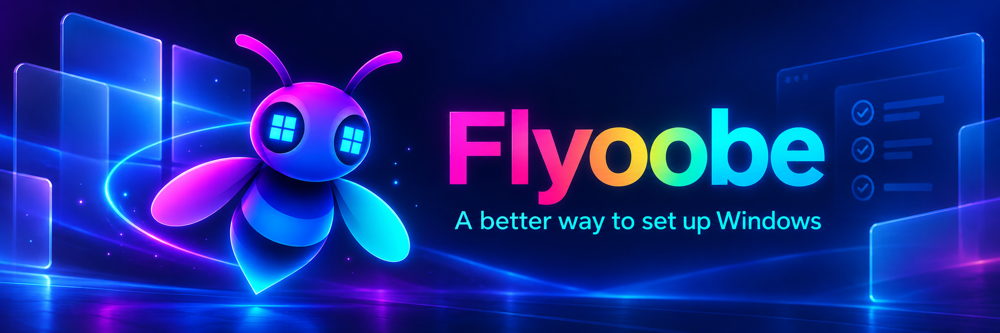

  

# Flyoobe

**Flyoobe is a focused Windows setup companion for people who want to make deliberate choices instead of clicking through somebody else's defaults.**

> [!IMPORTANT]
> **Flyoobe 3 has begun rolling out, and the project has changed substantially.** The application was rebuilt around a smaller, cleaner core. The refactored 3.x source is still being prepared for publication, so the source currently visible in this repository represents the previous generation. It will be replaced as soon as the new structure is ready to be maintained in public—not merely uploaded in a hurry.

[Download the latest release](https://github.com/builtbybel/Flyoobe/releases/latest) · [Read the changelog](CHANGELOG.md) · [Explore the documentation](docs/README.md)

## Downloads — choose the tool, not the biggest name

| Version | Best for | What you get | Download |
|---|---|---|---|
| **Flyoobe 3** — current generation | Setting up Windows, reviewing defaults or combining setup with an upgrade | Setup overview, recommendations, apps and debloating, personalization, recipes, optional Setup Actions and the Windows upgrade path when appropriate | [Download the latest Flyoobe](https://github.com/builtbybel/Flyoobe/releases/latest) |
| **Flyby11 Classic** — legacy | Doing only the familiar Windows 10 → 11 in-place upgrade on unsupported hardware | The original focused upgrade workflow and hardware-check workaround, with a minimal footprint | [Download Flyby11 Classic 2.4.854](https://github.com/builtbybel/Flyoobe/releases/download/2.4.854/Flyby11-classic-deprecated.zip) |

If all you need is the classic upgrade, Flyby11 can still be enough. It is no longer actively maintained, though. For the supported direction of the project—and for anything beyond getting through the upgrade door—use Flyoobe. It includes the upgrade path where it makes sense, then stays around for the part Flyby11 was never meant to solve: setting up Windows afterwards.

## How a small bypass became Flyoobe

This project started as **Flyby11**, a deliberately small answer to a very specific problem: perfectly usable PCs being stopped at the Windows 11 hardware checks.

Flyby11 helped people get through the installation door. But once they were inside, the more interesting questions began: Which defaults should stay? Which apps are useful? What should be removed? How can the same setup be repeated without turning the whole thing into an unreadable script?

That became **Flyoobe**.

Flyoobe 2 grew into an ambitious OOBE and upgrade toolbox. It proved the idea, but it also accumulated several ways of doing the same job. Flyoobe 3 is the reset: the useful ideas kept, the accidental complexity removed, and the workflow rebuilt around a simple overview of recommendations and personal choices.

Apparently software grows up much like people do: it stops trying to impress everyone at once and develops strong opinions about sensible defaults and tidy folders.

## What Flyoobe is now

Flyoobe 3 treats Windows setup as a short, understandable review instead of a maze of tweak pages.

- Check the PC against transparent, file-based recommendations.
- Separate real differences from choices that are simply personal.
- Configure accounts, networking, browsers, apps, personalization and Windows Update from one setup flow.
- Review and remove preinstalled apps only after confirmation.
- Export repeatable recipes without embedding opaque code in them.
- Extend the post-install workflow with optional, local **Setup Actions**.
- Open the Windows upgrade path when the machine and scenario call for it.

The interface intentionally uses native Windows controls. It is modern where that helps, but it borrows some clarity, colour and friendliness from Windows 7—the last Windows version that seemed to know where everything lived.

## Current repository status

| Part | Status |
|---|---|
| Flyoobe 3 releases | Active |
| Refactored Flyoobe 3 source | Being prepared; coming soon |
| Source currently on the default branch | Previous Flyoobe generation |
| Setup Actions | New optional extension model |
| Flyby11 | Historical predecessor; retained but no longer actively maintained |
| Flyoobe Extensions | Retired and replaced by Setup Actions |

This temporary split is intentional. A large refactor deserves a source tree that can be understood after the release-day coffee has worn off.

## Optional Setup Actions

Setup Actions add small PowerShell-based jobs without turning Flyoobe itself into a collection of hard-coded utilities. Actions can provide descriptions, selectable commands, live output and—in explicitly approved cases—recipe integration.

They are optional and disabled by default.

### Install the Actions asset

1. Download the **Actions** asset from the [release page](https://github.com/builtbybel/Flyoobe/releases/latest).
2. Extract the included `Actions` folder into Flyoobe's `Data` folder. The resulting path should look like `Data\Actions\<action-id>\action.ini`.
3. Open **Settings > Advanced** in Flyoobe and enable **Setup Actions**.

The packages maintained for the optional asset live in [`Actions`](Actions). The complete authoring and safety guide is in [`docs/setup-actions.md`](docs/setup-actions.md).

> [!CAUTION]
> Setup Actions are PowerShell. Read an action before running it, especially when it requests administrator rights or downloads code. Flyoobe never runs an action merely because the package exists.

## Flyby11 and the old source

Flyby11 remains in the repository because it is where this project began and because the classic upgrader still explains an important part of Flyoobe's history. It is now legacy software and is not actively maintained.

The same applies to the previous Flyoobe implementation currently present in the source tree. It remains available during the transition, but new development targets the refactored Flyoobe 3 codebase. See [`docs/legacy.md`](docs/legacy.md) for the exact distinction.

## A note about unsupported Windows upgrades

Hardware-check workarounds do not turn unsupported hardware into supported hardware. Microsoft can change setup behavior or update eligibility, and newer Windows releases may introduce requirements that software cannot bypass. Keep backups and understand the trade-off before upgrading.

## Support development

Flyoobe is built independently and shared freely. If it saved you time—or saved a good PC from an unnecessarily early retirement—you can [support the project here](https://www.paypal.com/donate?hosted_button_id=MY7HX4QLYR4KG).

Thank you for testing, reporting the strange corners of Windows setup, and giving this little bee far more places to fly than I expected when Flyby11 began.
